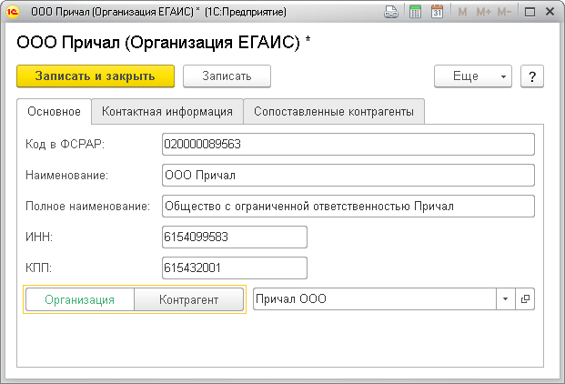
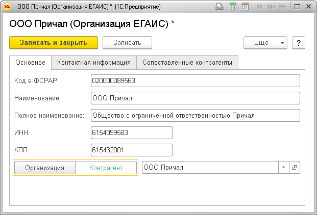
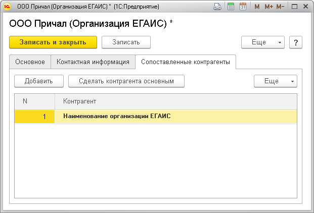
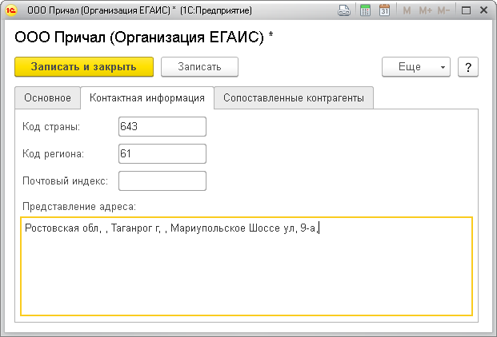
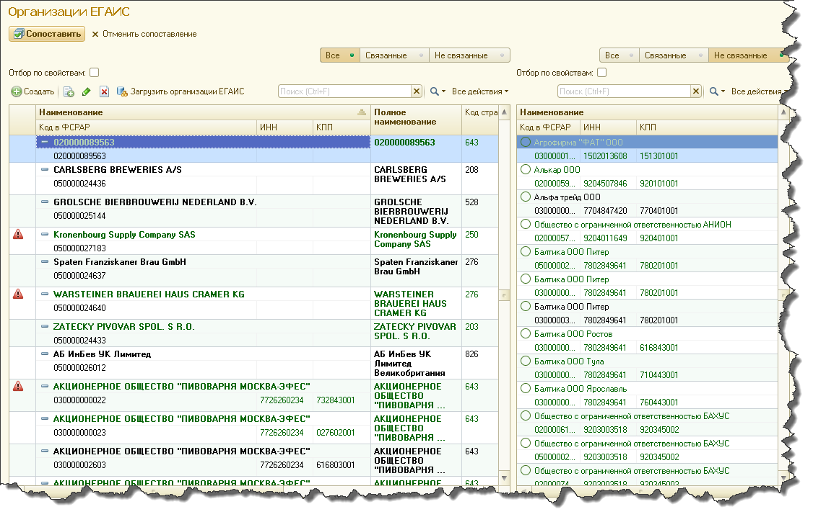
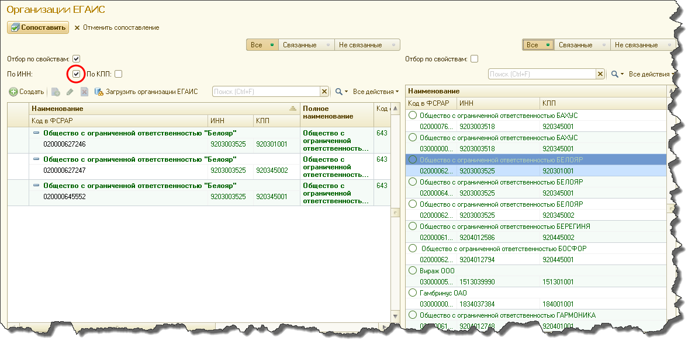

.. _организации_егаис:

Организации ЕГАИС
=================

Справочник организации ЕГАИС
----------------------------
Организация ЕГАИС - справочник, содержащий сведения об организации, зарегистрированной в ЕГАИС, в том числе: 

**Основные сведения**

* Код ФСРАР - уникальный 12-ти значный идентификатор организации в ФСРАР, 
* Краткое и полное наименования организации
* ИНН - Индивидуальный номер налогоплательщика
* КПП - код причины постановки на учет

* Вид организации ЕГАИС. Организации, хранящиеся в базе данных ЕГАИС по отношению к пользователю можно разделить на 2 категории:

	#. организации от имени которых ведется учет ЕГАИС. Такие организации ЕГАИС требуют сопоставления с элементами справочника ``Организации`` в информационной базе 1С. 
	#. организации в отношении которых выполняются операции в ЕГАИС, например, отгрузка алкогольной продукции или её поступление т.е. контрагенты. Требует сопоставления с элементами справочника ``Контрагенты``.
   
В первом случае (см пп. 1) реквизит ``Вид организации ЕГАИС`` должен быть установлен в значение ``Организация``. При этом требуется указать организацию информационной базы, которая будет сопоставлена текущей организации ЕГАИС.

Во втором случае (пп. 2)  необходимо выбрать значение ``Контрагент``.
   

В данном примере организация ЕГАИС ООО "Причал" является контрагентом. Соответствующий элемент справочника контрагенты (информационной базы 1С) подбирается в поле рядом с переключателем.    

.. note:: Иногда, при организации учета ЕГАИС индивидуальных предпринимателей, пользователи применяют практику сопоставления одной организации ЕГАИС с двумя и более контрагентами информационной базы (множественное сопоставление). Это делается для того чтобы организовать обособленный учет деятельности торговых точек индивидуальных предпринимателей поскольку ИП не имеет КПП и понятия обособленного подразделения для ИП не существует.

Для множественного сопоставления организации ЕГАИС с контрагентами информационой базы необходимо заполнить табличную часть ``Сопоставленные контрагенты``

При этом одного из контрагентов можно пометить как основной (для этого используется комманда ``Сделать контрагента  основным``). Это означает, что данный контрагент будет использован по умолчанию для подстановки организации при заполнении документов ЕГАИС.

**Контактная информация**

На закладке ``Контатная информация`` необходимо заполнить следующие поля:

* ``Код страны``
* ``Код региона``
* ``Почтовый индекс``
* ``Представление адреса``

Отбор по критериям
------------------

При открытии окна "Организации ЕГАИС" вы увидите форму, в которой в левой половине находится список организаций ЕГАИС, а справа список контрагентов из вашей базы.

Над обоими списками находятся опции для отбора, вы можете как в левом, так и в правом списке отфильтровать организации по сопоставленности переключая тумблеры "Все", "Связанные", "Не связанные".

Также доступны более детальные отборы по критериям. С обоих сторон доступны галочки "Отбор по свойствам". Включая их вы можете отбирать организации по разным свойствам. Если вы например с левой стороны включите галочку "Вид продукции" под галочкой "Отбор по свойствам", то в списке номенклатуры ЕГАИС отобразится только та номенклатура, которая соответствует тому коду продукции, которому соответствует номенклатура, выбранная справа. Чтобы поменять выбор, просто щелкните один раз на другую номенклатуру и список, в котором ведётся отбор переформируется.

